# Diagramas de Fluxo - Sistema de Acompanhamento de Tratamento

Este documento contém todos os diagramas de fluxo da aplicação, organizados por domínio.

---

## 📊 Índice

1. [Arquitetura Geral do Sistema](#1-arquitetura-geral-do-sistema)
2. [Estrutura de Dados Firestore](#2-estrutura-de-dados-firestore)
3. [Fluxo de Autenticação e Registro](#3-fluxo-de-autenticação-e-registro)
4. [Fluxo de Medicamentos](#4-fluxo-de-medicamentos)
5. [Fluxo de Sintomas](#5-fluxo-de-sintomas)
6. [Fluxo de Registros de Dose](#6-fluxo-de-registros-de-dose)
7. [Fluxo de InfoCards (Conteúdo Educacional)](#7-fluxo-de-infocards-conteúdo-educacional)
8. [Fluxo de Lembretes de Medicação](#8-fluxo-de-lembretes-de-medicação)
9. [Fluxo de Calendário de Sintomas](#9-fluxo-de-calendário-de-sintomas)

---

## 1. Arquitetura Geral do Sistema

```mermaid
graph TB
    subgraph "Frontend - Aplicativo Móvel"
        A[Telas do App]
        B[Firebase SDK]
    end

    subgraph "Firebase Services"
        C[Firebase Authentication]
        D[Cloud Firestore]
    end

    subgraph "Firestore Collections"
        E[/users/{uid}]
        F[/infoCards]
        G[/users/{uid}/medicamentos]
        H[/users/{uid}/sintomas]
        I[/users/{uid}/registrosDeDose]
    end

    A -->|Auth Operations| B
    B -->|createUser/signIn| C
    B -->|CRUD Operations| D
    D --> E
    D --> F
    E --> G
    E --> H
    E --> I

    style C fill:#4285f4
    style D fill:#ffca28
    style E fill:#34a853
    style F fill:#ea4335
    style G fill:#fbbc04
    style H fill:#34a853
    style I fill:#ea4335
```

---

## 2. Estrutura de Dados Firestore

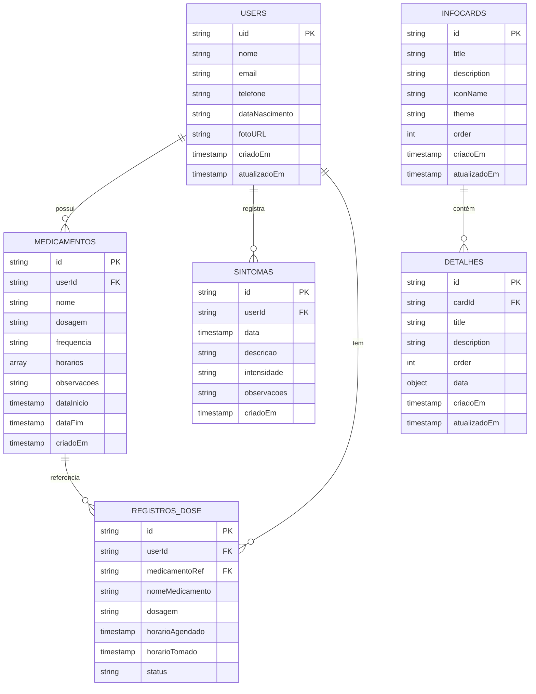

---

## 3. Fluxo de Autenticação e Registro

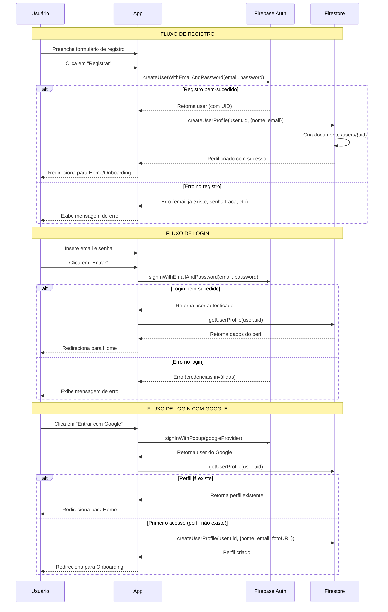

---

## 4. Fluxo de Medicamentos

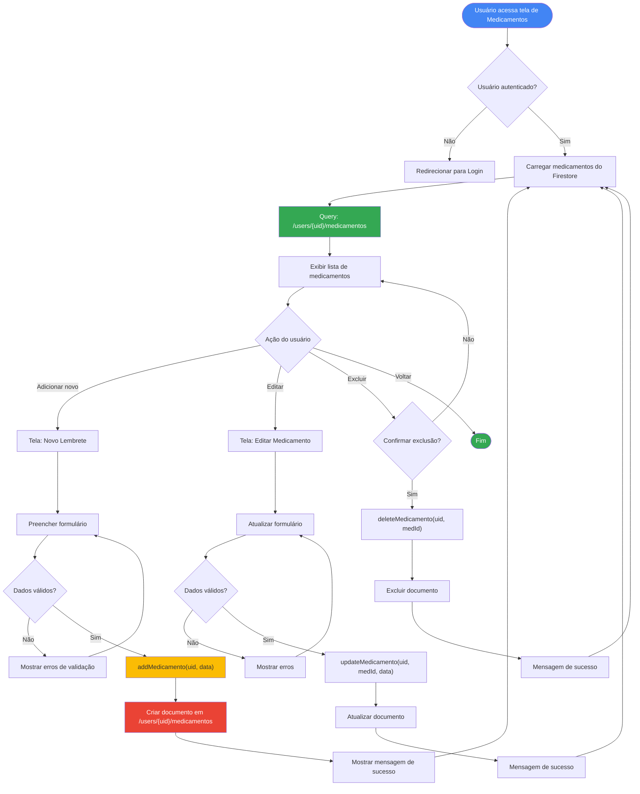

### Estrutura do Formulário "Novo Lembrete"

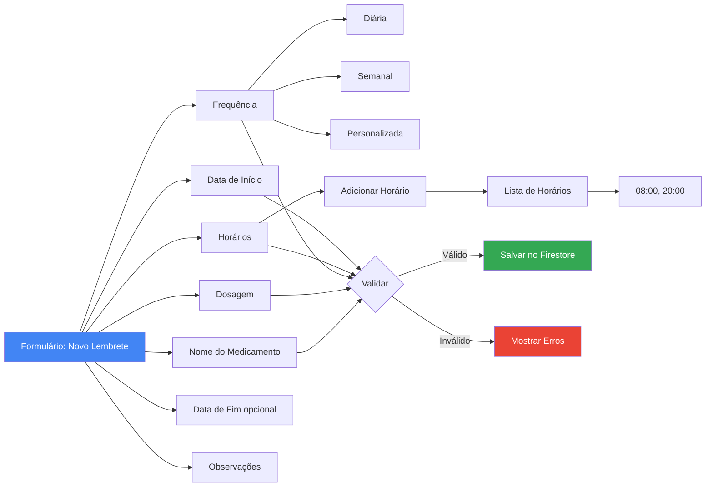

---

## 5. Fluxo de Sintomas

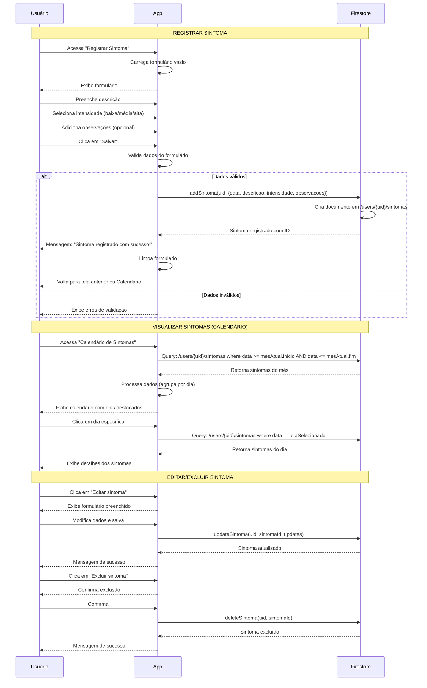

### Fluxograma do Calendário de Sintomas

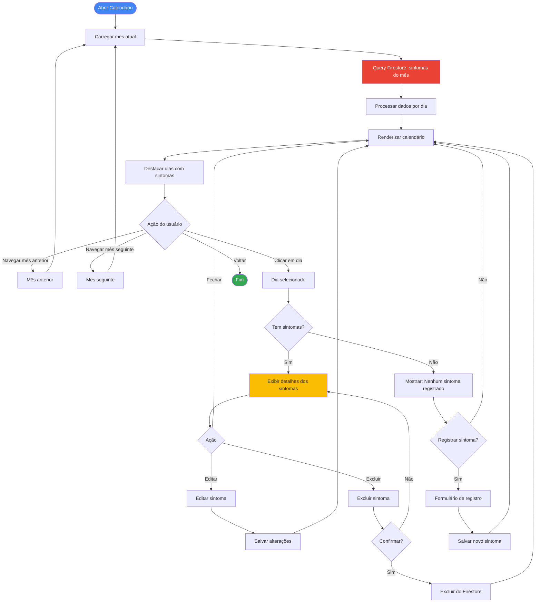

---

## 6. Fluxo de Registros de Dose

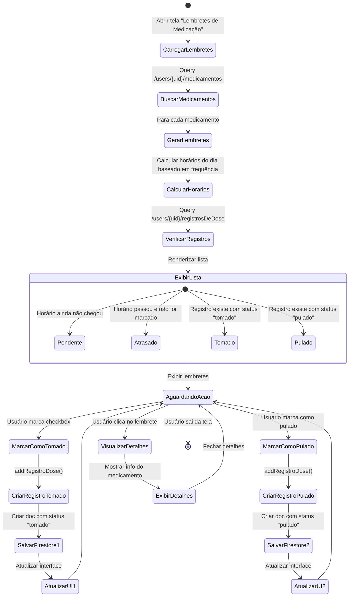

### Sequência Detalhada: Marcar como Tomado

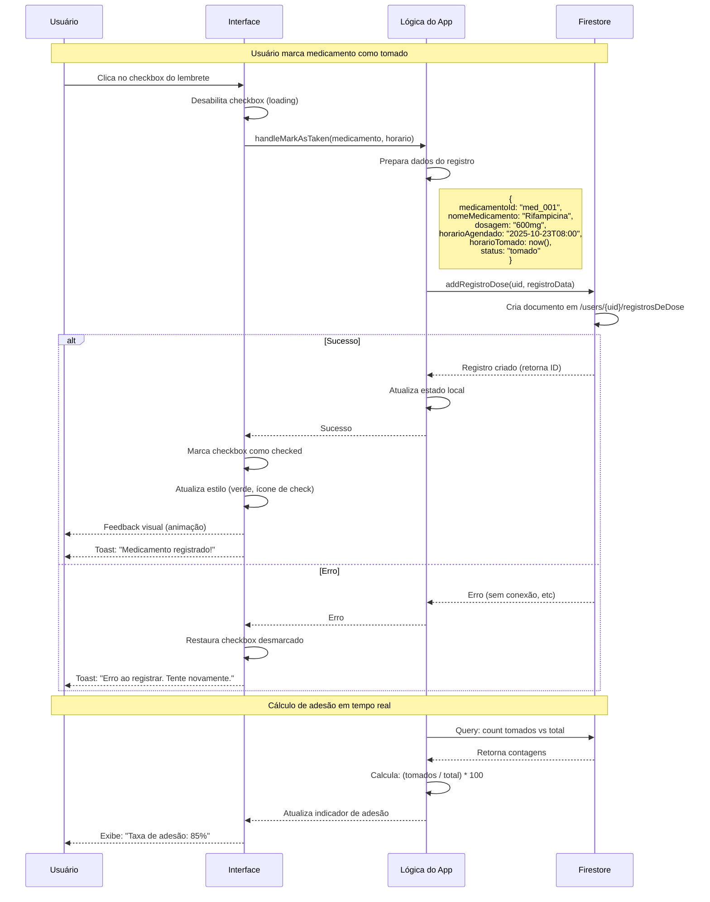

---

## 7. Fluxo de InfoCards (Conteúdo Educacional)

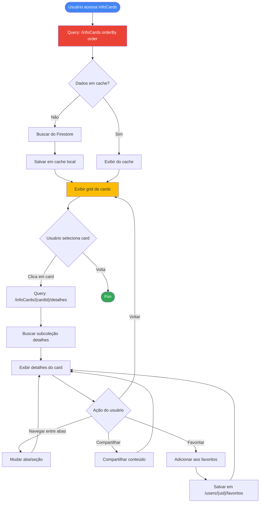

### Cards Disponíveis

```mermaid
graph TD
    Root[InfoCards] --> Card1[Card 1: Sinais e Sintomas]
    Root --> Card2[Card 2: Transmissão]
    Root --> Card3[Card 3: Diagnóstico]
    Root --> Card4[Card 4: Tratamento]
    Root --> Card5[Card 5: Reações Adversas]
    Root --> Card6[Card 6: Interações Medicamentosas]
    Root --> Card7[Card 7: Reações da Tuberculose]
    Root --> Card8[Card 8: Autocuidado]
    Root --> Card9[Card 9: Prevenção]
    Root --> Card10[Card 10: TB-HIV]
    Root --> Card11[Card 11: Epidemiologia]

    Card1 --> Det1[8 documentos em /detalhes]
    Card2 --> Det2[7 documentos em /detalhes]
    Card3 --> Det3[8 documentos em /detalhes]
    Card4 --> Det4[8 documentos em /detalhes]
    Card5 --> Det5[7 documentos em /detalhes]
    Card6 --> Det6[5 documentos em /detalhes]
    Card7 --> Det7[5 documentos em /detalhes]
    Card8 --> Det8[5 documentos em /detalhes]
    Card9 --> Det9[6 documentos em /detalhes]
    Card10 --> Det10[9 documentos em /detalhes]
    Card11 --> Det11[8 documentos em /detalhes]

    style Root fill:#4285f4,color:#fff
    style Card1 fill:#ea4335,color:#fff
    style Card4 fill:#34a853,color:#fff
    style Card8 fill:#fbbc04
```

---

## 8. Fluxo de Lembretes de Medicação

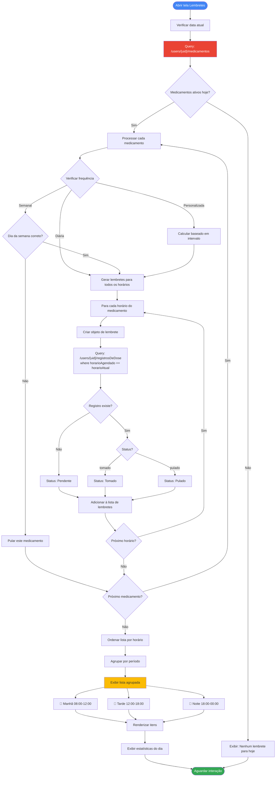

### Componente de Lembrete Individual

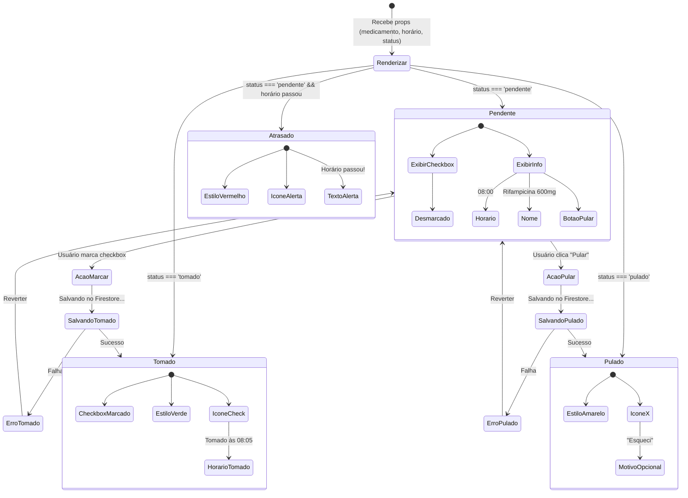

---

## 9. Fluxo de Calendário de Sintomas

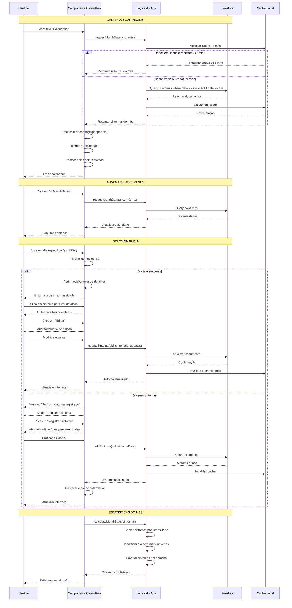

### Visualização de Intensidade no Calendário

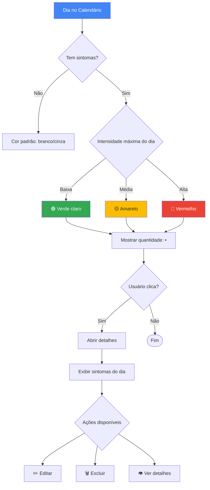

---

## 10. Fluxo Completo: Dia Típico de Uso

```mermaid
journey
    title Jornada do Usuário - Dia Típico
    section Manhã (08:00)
        Recebe notificação: 5: Usuário
        Abre app: 5: Usuário
        Vê lembretes da manhã: 5: Usuário, App
        Marca Rifampicina como tomada: 5: Usuário, App, Firestore
        Marca Isoniazida como tomada: 5: Usuário, App, Firestore
        Vê taxa de adesão atualizada: 4: Usuário, App
    section Tarde (14:00)
        Sente sintomas leves: 3: Usuário
        Abre app: 4: Usuário
        Acessa "Registrar Sintoma": 5: Usuário, App
        Descreve sintoma: 5: Usuário
        Salva registro: 5: Usuário, App, Firestore
        Sintoma aparece no calendário: 5: Usuário, App
    section Noite (20:00)
        Recebe notificação: 5: Usuário
        Abre app: 5: Usuário
        Vê lembrete da noite: 5: Usuário, App
        Esqueceu o medicamento: 2: Usuário
        Marca como "Pulado": 3: Usuário, App, Firestore
        Vê taxa de adesão diminuir: 2: Usuário, App
    section Antes de dormir (22:00)
        Abre app por curiosidade: 4: Usuário
        Navega pelos InfoCards: 5: Usuário, App, Firestore
        Lê sobre "Reações Adversas": 5: Usuário, App
        Compartilha info com familiar: 5: Usuário, App
        Fecha app: 5: Usuário
```

---

## Resumo dos Domínios

### Domínios Principais:

1. **Autenticação** - Registro, login, gerenciamento de sessão
2. **Medicamentos** - CRUD de medicamentos com horários e frequências
3. **Sintomas** - Registro diário com intensidade e calendário
4. **Registros de Dose** - Tracking de adesão (tomado/pulado)
5. **InfoCards** - Conteúdo educacional sobre tuberculose
6. **Notificações** - Lembretes push (a ser implementado)
7. **Estatísticas** - Dashboards de adesão e progresso

### Integrações entre Domínios:

- **Auth → Todos** - UID usado como chave em todas as coleções
- **Medicamentos → Registros** - Referência direta via path
- **Sintomas → Calendário** - Visualização agregada por data
- **InfoCards ← Standalone** - Compartilhado entre todos os usuários

---

**Documentação gerada em:** 2025-10-23
**Versão:** 1.0
**Projeto:** Sistema de Acompanhamento de Tratamento de Tuberculose
