# Visão Geral do Projeto

> **Sistema de Acompanhamento de Tratamento de Tuberculose**
>
> Aplicação para auxiliar pacientes no tratamento de tuberculose através de lembretes de medicação, registro de sintomas e acesso a conteúdo educacional.

---

## 📋 O que é este projeto?

Este projeto é composto por **dois sistemas principais**:

### 1. 🏥 Sistema de Acompanhamento do Paciente
Ferramenta digital para pacientes em tratamento de tuberculose que permite:
- ✅ Gerenciar medicamentos e horários
- 📅 Receber lembretes para tomar medicação
- 🩺 Registrar sintomas diariamente
- 📊 Acompanhar taxa de adesão ao tratamento
- 📈 Visualizar progresso no calendário

### 2. 📚 Base de Conhecimento sobre Tuberculose
Conteúdo educacional estruturado com informações sobre:
- Sinais e sintomas
- Formas de transmissão
- Processo de diagnóstico
- Esquemas de tratamento
- Reações adversas e interações
- Prevenção e autocuidado
- TB-HIV e epidemiologia

---

## 🎯 Problema que Resolve

### Desafios do Tratamento de Tuberculose:

1. **Longa Duração** - Tratamento dura 6 meses ou mais
2. **Múltiplos Medicamentos** - Até 5 medicamentos diferentes
3. **Horários Rígidos** - Necessário tomar em horários específicos
4. **Baixa Adesão** - 20-30% dos pacientes abandonam o tratamento
5. **Falta de Informação** - Pacientes não entendem a importância da adesão

### Nossa Solução:

- 📱 **Aplicativo Móvel** - Sempre disponível no bolso
- 🔔 **Lembretes Push** - Notificações nos horários certos
- 📊 **Gamificação** - Taxa de adesão visível motiva o paciente
- 🩺 **Monitoramento** - Registro de sintomas ajuda médicos
- 📚 **Educação** - Conteúdo claro e acessível

---

## 🏗️ Arquitetura do Sistema

```
┌─────────────────────────────────────────────────────────┐
│                   APLICATIVO MÓVEL                      │
│  (React Native / Flutter / Web - Frontend)              │
│                                                          │
│  ┌──────────┐  ┌──────────┐  ┌──────────┐             │
│  │ Lembretes│  │ Sintomas │  │ InfoCards│             │
│  │    de    │  │    e     │  │ Educação │             │
│  │Medicação │  │Calendário│  │          │             │
│  └──────────┘  └──────────┘  └──────────┘             │
└─────────────────────────────────────────────────────────┘
                        │
                        ▼
┌─────────────────────────────────────────────────────────┐
│              FIREBASE (Backend as a Service)            │
│                                                          │
│  ┌─────────────────────┐    ┌──────────────────────┐  │
│  │ Authentication      │    │ Cloud Firestore      │  │
│  │ ├─ Email/Senha     │    │ ├─ /users/{uid}     │  │
│  │ ├─ Google OAuth    │    │ ├─ /infoCards       │  │
│  │ └─ Sessões        │    │ └─ Subcoleções      │  │
│  └─────────────────────┘    └──────────────────────┘  │
│                                                          │
│  ┌─────────────────────┐    ┌──────────────────────┐  │
│  │ Cloud Messaging     │    │ Cloud Storage        │  │
│  │ (Push Notifications)│    │ (Imagens do perfil)  │  │
│  └─────────────────────┘    └──────────────────────┘  │
└─────────────────────────────────────────────────────────┘
                        │
                        ▼
┌─────────────────────────────────────────────────────────┐
│          SCRIPTS DE POPULAÇÃO (Este Repositório)       │
│                                                          │
│  ┌──────────────────────────────────────────────────┐  │
│  │ populate-firestore.js     → InfoCards            │  │
│  │ populate-usuarios.js      → Usuários de teste    │  │
│  │ auth-integration.js       → Funções para o app   │  │
│  └──────────────────────────────────────────────────┘  │
└─────────────────────────────────────────────────────────┘
```

---

## 📊 Estrutura de Dados

### Hierarquia no Firestore:

```
firestore (root)
│
├── infoCards/                          [Conteúdo Educacional - Compartilhado]
│   ├── card_1/                         (Sinais e Sintomas)
│   │   ├── title: "Sinais e Sintomas"
│   │   ├── description: "..."
│   │   └── detalhes/                   [Subcoleção]
│   │       ├── sintomas-classicos
│   │       ├── sintomas-formas
│   │       └── ... (8 documentos)
│   ├── card_2/                         (Transmissão)
│   ├── card_3/                         (Diagnóstico)
│   └── ... (11 cards no total)
│
└── users/                              [Dados dos Pacientes - Individual]
    └── {uid}/                          (UID do Firebase Authentication)
        ├── nome: "João Silva"
        ├── email: "joao@email.com"
        ├── telefone: "+55 11 98765-4321"
        ├── dataNascimento: "1985-03-15"
        │
        ├── medicamentos/               [Subcoleção]
        │   ├── {medId}/
        │   │   ├── nome: "Rifampicina"
        │   │   ├── dosagem: "600mg"
        │   │   ├── frequencia: "diaria"
        │   │   ├── horarios: ["08:00", "20:00"]
        │   │   ├── dataInicio: timestamp
        │   │   └── dataFim: timestamp
        │   └── ... (múltiplos medicamentos)
        │
        ├── sintomas/                   [Subcoleção]
        │   ├── {sintomaId}/
        │   │   ├── data: timestamp
        │   │   ├── descricao: "Tosse seca, febre"
        │   │   ├── intensidade: "media"
        │   │   └── observacoes: "..."
        │   └── ... (histórico de sintomas)
        │
        └── registrosDeDose/            [Subcoleção]
            ├── {registroId}/
            │   ├── medicamentoRef: "/users/{uid}/medicamentos/{medId}"
            │   ├── nomeMedicamento: "Rifampicina"
            │   ├── dosagem: "600mg"
            │   ├── horarioAgendado: timestamp
            │   ├── horarioTomado: timestamp
            │   └── status: "tomado" | "pulado"
            └── ... (histórico de doses)
```

---

## 👥 Personas (Quem Usa o Sistema)

### 1. 🧑‍⚕️ Paciente em Tratamento

**Perfil:**
- Nome: Maria Silva, 35 anos
- Situação: Diagnosticada com TB pulmonar há 2 semanas
- Desafio: Trabalha em horário comercial, esquece de tomar medicação
- Objetivo: Completar tratamento sem abandonar

**Como usa o app:**
1. Recebe notificação às 8h da manhã
2. Abre app e vê lista de medicamentos
3. Marca cada um como "tomado" após ingerir
4. Se tiver sintomas, registra no calendário
5. Consulta InfoCards quando tem dúvidas

### 2. 👨‍⚕️ Profissional de Saúde

**Perfil:**
- Nome: Dr. Carlos, médico do PSF
- Situação: Acompanha 15 pacientes com TB
- Desafio: Difícil monitorar adesão de todos
- Objetivo: Identificar rapidamente quem está em risco de abandono

**Como usa o sistema:**
- Acessa dashboard (funcionalidade futura)
- Vê taxa de adesão de cada paciente
- Identifica quem está pulando doses
- Vê sintomas reportados para ajustar tratamento

### 3. 👨‍💻 Desenvolvedor

**Perfil:**
- Nome: Ana Paula, desenvolvedora frontend
- Situação: Precisa integrar o app mobile com Firebase
- Desafio: Nunca trabalhou com Firebase antes
- Objetivo: Implementar funcionalidades rapidamente

**Como usa este repositório:**
1. Lê README e OVERVIEW para entender o sistema
2. Usa scripts de população para popular dados de teste
3. Consulta `auth-integration.js` para ver funções prontas
4. Lê DIAGRAMAS.md para entender fluxos
5. Copia e adapta código para o app

---

## 🔑 Conceitos Importantes

### 1. Firebase Authentication x Firestore

**Firebase Authentication:**
- Sistema de login/senha e OAuth
- Gera um UID único para cada usuário
- Gerencia sessões e tokens

**Firestore (Banco de Dados):**
- Armazena dados do perfil e subcoleções
- Usa UID como chave primária
- Queries baseadas no usuário logado

**Conexão entre os dois:**
```javascript
// 1. Usuário se registra no Authentication
const user = await createUser(email, password);
// user.uid = "abc123xyz"

// 2. Cria documento no Firestore usando o mesmo UID
await db.collection('users').doc(user.uid).set({
  nome: "João Silva",
  email: user.email
});

// 3. Agora o UID conecta Authentication com Firestore!
```

### 2. Coleções vs Subcoleções

**Coleção (Raiz):**
```
/users/{uid}
/infoCards/{cardId}
```
- Documentos independentes
- Queries globais possíveis
- Exemplo: Buscar todos os usuários

**Subcoleção:**
```
/users/{uid}/medicamentos/{medId}
/users/{uid}/sintomas/{sintomaId}
```
- Documentos aninhados dentro de outro
- Queries limitadas ao documento pai
- Exemplo: Buscar medicamentos de UM usuário específico

### 3. Timestamps vs Strings

**❌ Evitar:**
```javascript
data: "2025-10-23"  // String - difícil de fazer queries
```

**✅ Usar:**
```javascript
data: new Date("2025-10-23")  // Timestamp - Firestore otimiza queries
```

### 4. Denormalização (Duplicação de Dados)

No SQL tradicional, você evita duplicação. No NoSQL/Firestore, **duplicação é estratégica**:

**Exemplo:**
```javascript
// Em registrosDeDose, duplicamos nome e dosagem
{
  medicamentoRef: "/users/abc/medicamentos/med_001",  // Referência
  nomeMedicamento: "Rifampicina",                      // DUPLICADO
  dosagem: "600mg"                                     // DUPLICADO
}
```

**Por quê?**
- **Performance:** Não precisa fazer JOIN (Firestore não tem JOIN)
- **Leitura rápida:** Exibe o nome sem buscar o medicamento original
- **Custo:** Firestore cobra por leituras - menos queries = menos custo

---

## 🚀 Fluxo de Trabalho Típico

### Para o Desenvolvedor do App:

```mermaid
graph TD
    A[1. Clone este repositório] --> B[2. Configure Firebase]
    B --> C[3. Popule dados de teste]
    C --> D[4. Estude os diagramas]
    D --> E[5. Copie funções de auth-integration.js]
    E --> F[6. Implemente no app]
    F --> G[7. Teste com usuário real]
    G --> H[8. Deploy]

    style A fill:#4285f4,color:#fff
    style H fill:#34a853,color:#fff
```



### Para o Paciente:

```mermaid
graph TD
    A[1. Baixa app da loja] --> B[2. Cria conta]
    B --> C[3. Médico cadastra medicamentos]
    C --> D[4. Paciente recebe notificações]
    D --> E[5. Marca como tomado]
    E --> F[6. Registra sintomas]
    F --> G[7. Consulta taxa de adesão]
    G --> H[8. Completa tratamento]

    style A fill:#4285f4,color:#fff
    style H fill:#34a853,color:#fff
```



---

## 📁 Estrutura de Arquivos do Repositório

```
popularFireBase/
│
├── 📄 README.md                    → Documentação principal (comandos npm)
├── 📄 OVERVIEW.md                  → Este arquivo (visão geral)
├── 📄 SETUP.md                     → Guia passo a passo de instalação
├── 📄 DIAGRAMAS.md                 → Todos os fluxos em Mermaid
├── 📄 API.md                       → Referência de funções
├── 📄 GLOSSARIO.md                 → Termos técnicos explicados
├── 📄 FAQ.md                       → Perguntas frequentes
├── 📄 CONTRIBUTING.md              → Como contribuir
│
├── 🔧 firebase-config.js           → Configuração do Firebase Admin SDK
├── 🔧 package.json                 → Dependências e scripts npm
├── 🔧 .gitignore                   → Arquivos ignorados no Git
│
├── 📂 data/                        → Dados de exemplo
│   ├── sinais-sintomas-data.js
│   ├── tratamento-data.js
│   ├── usuarios-exemplo-data.js   → Dados de teste de usuários
│   └── ... (11 arquivos de dados)
│
├── 🔄 populate-firestore.js        → Popula infoCards
├── 🔄 populate-sinais-sintomas.js
├── 🔄 populate-tratamento.js
├── 🔄 populate-usuarios.js         → Popula usuários de teste
├── 🔄 ... (12 scripts de população)
│
└── ⚙️ auth-integration.js          → Funções prontas para usar no app
                                      (createUserProfile, addMedicamento, etc)
```

### Arquivos Mais Importantes:

| Arquivo | Para quê serve | Quando usar |
|---------|----------------|-------------|
| `README.md` | Comandos e referência rápida | Consulta diária |
| `OVERVIEW.md` | Entender o projeto como um todo | Primeiro contato |
| `SETUP.md` | Configurar ambiente pela primeira vez | Instalação inicial |
| `auth-integration.js` | Copiar funções para o app | Durante desenvolvimento |
| `DIAGRAMAS.md` | Entender fluxos e lógica | Implementar features |
| `populate-usuarios.js` | Testar com dados reais | Testes locais |

---

## 🎓 Conceitos de Negócio

### O que é Adesão ao Tratamento?

**Definição:** Percentual de doses tomadas corretamente.

**Fórmula:**
```
Adesão = (Doses Tomadas / Doses Agendadas) × 100
```

**Exemplos:**
- ✅ **95% de adesão** - Excelente (tratamento eficaz)
- ⚠️ **75% de adesão** - Preocupante (risco de resistência)
- ❌ **50% de adesão** - Grave (tratamento ineficaz)

### Esquema Básico de Tratamento

**Fase Intensiva (2 meses):**
- Rifampicina (R) 600mg
- Isoniazida (H) 300mg
- Pirazinamida (Z) 1500mg
- Etambutol (E) 1200mg

**Fase de Manutenção (4 meses):**
- Rifampicina (R) 600mg
- Isoniazida (H) 300mg

**No app:**
- Cadastrar os 4 medicamentos no início
- Após 2 meses, médico remove Z e E
- Sistema continua rastreando R e H

### Por que Múltiplos Medicamentos?

**Problema:** Bactéria da TB se reproduz devagar
**Solução:** Múltiplos medicamentos com mecanismos diferentes

Se tomar apenas 1 medicamento:
- Bactéria pode desenvolver resistência
- Tratamento falha
- Paciente pode desenvolver TB-DR (drogarresistente)

---

## 🔐 Segurança e Privacidade

### Regras de Acesso (Firestore Rules)

```javascript
// Cada usuário só acessa seus próprios dados
rules_version = '2';
service cloud.firestore {
  match /databases/{database}/documents {

    // Qualquer pessoa pode ler infoCards (conteúdo público)
    match /infoCards/{cardId} {
      allow read: if true;
      allow write: if false; // Apenas admin pode escrever

      match /detalhes/{detailId} {
        allow read: if true;
      }
    }

    // Usuário só acessa seus próprios dados
    match /users/{userId} {
      allow read, write: if request.auth != null && request.auth.uid == userId;

      match /medicamentos/{medId} {
        allow read, write: if request.auth.uid == userId;
      }

      match /sintomas/{sintomaId} {
        allow read, write: if request.auth.uid == userId;
      }

      match /registrosDeDose/{registroId} {
        allow read, write: if request.auth.uid == userId;
      }
    }
  }
}
```

### Dados Sensíveis

**O que NÃO armazenamos:**
- CPF ou RG (não é necessário)
- Endereço completo (apenas cidade/estado se necessário)
- Dados de cartão de crédito (app é gratuito)
- Senhas em texto plano (Firebase Authentication cuida disso)

**O que armazenamos:**
- Nome completo (para personalização)
- Email (para login e recuperação)
- Telefone (opcional, para contato de emergência)
- Dados de saúde (sintomas, medicamentos) - protegidos por UID

---

## 📈 Métricas de Sucesso

Como medimos se o projeto está funcionando:

### Métricas do Paciente:

1. **Taxa de Adesão** - Objetivo: >95%
2. **Taxa de Conclusão** - Objetivo: >80% completam 6 meses
3. **Frequência de Uso** - Objetivo: Uso diário
4. **Sintomas Registrados** - Objetivo: Pelo menos 1x por semana

### Métricas Técnicas:

1. **Tempo de Resposta** - Objetivo: <500ms
2. **Taxa de Erro** - Objetivo: <1%
3. **Disponibilidade** - Objetivo: >99.9%
4. **Custo Firebase** - Objetivo: <$50/mês para 1000 usuários ativos

---

## 🗺️ Roadmap (Próximos Passos)

### ✅ Fase 1: MVP (Concluída)
- [x] Estrutura de dados definida
- [x] Scripts de população
- [x] Funções de integração com Auth
- [x] Documentação completa

### 🚧 Fase 2: App Mobile (Em Desenvolvimento)
- [ ] Interface de registro/login
- [ ] Tela de lembretes
- [ ] Tela de sintomas
- [ ] Calendário
- [ ] InfoCards

### 📋 Fase 3: Notificações
- [ ] Push notifications
- [ ] Lembretes inteligentes
- [ ] Alertas de atraso

### 🎯 Fase 4: Recursos Avançados
- [ ] Dashboard para médicos
- [ ] Gráficos de progresso
- [ ] Exportar relatórios PDF
- [ ] Compartilhar com médico

### 🚀 Fase 5: Escalabilidade
- [ ] Cloud Functions para processamento
- [ ] Machine Learning para predição de abandono
- [ ] Integração com sistemas de saúde
- [ ] Versão web do app

---

## 🤝 Como Contribuir

Veja o arquivo [CONTRIBUTING.md](./CONTRIBUTING.md) para detalhes sobre:
- Como reportar bugs
- Como sugerir melhorias
- Como enviar pull requests
- Padrões de código

---

## 📞 Contato e Suporte

- **Issues:** [GitHub Issues](https://github.com/seu-usuario/popularFireBase/issues)
- **Discussões:** [GitHub Discussions](https://github.com/seu-usuario/popularFireBase/discussions)
- **Email:** suporte@projeto.com.br

---

## 📚 Recursos Adicionais

### Sobre Tuberculose:
- [Manual Técnico do Ministério da Saúde (BR)](http://www.saude.gov.br)
- [WHO - Tuberculosis](https://www.who.int/health-topics/tuberculosis)
- [CDC - TB Information](https://www.cdc.gov/tb/)

### Sobre Firebase:
- [Documentação Oficial Firebase](https://firebase.google.com/docs)
- [Firestore Data Model](https://firebase.google.com/docs/firestore/data-model)
- [Firebase Authentication](https://firebase.google.com/docs/auth)

### Sobre React Native / Flutter:
- [React Native Firebase](https://rnfirebase.io/)
- [FlutterFire](https://firebase.flutter.dev/)

---

## 📄 Licença

[MIT License](./LICENSE) - Livre para uso, modificação e distribuição.

---

**Última atualização:** 2025-10-23
**Versão:** 1.0
**Mantenedor:** Equipe do Projeto
